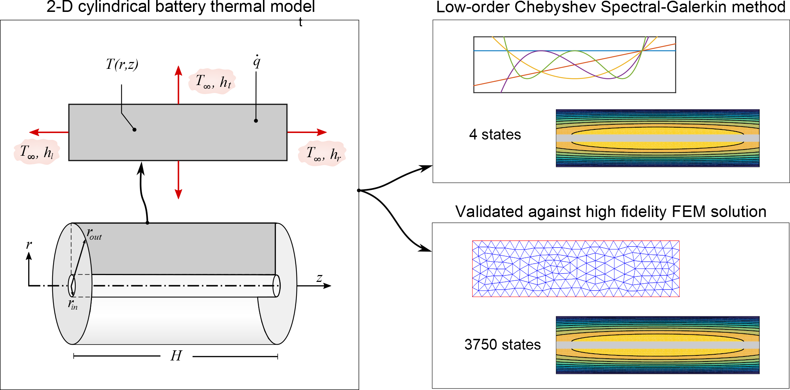

2-D Spectral-Galerkin Battery Thermal Model
===========================================



This repository contains the Matlab source code to implement a 2-D Chebyshev Spectral Galerkin thermal model and
compare it against a finite element (FEM) model.

An accompanying paper for this code entitled
"On-board monitoring of 2-D spatially-resolved temperatures
in cylindrical lithium-ion batteries: Part I. Low-order thermal modelling"
has been submitted for publication in the Journal of Power Sources. A 
preprint for this paper will be made available on [arxiv.org][1] shortly. 

I would ask that you cite this paper if you want to use this code for 
your own research.
This code has been developed at the Department of Engineering Science of 
the University of Oxford. 
For information about our lithium-ion battery research, 
visit the [Howey Research Group][2] website.
If you are interested in our energy research, 
check out our research group website [Energy and Power Group][3].

Feel free to email the authors with any questions:  
[Robert Richardson](mailto:robert.richardson@eng.ox.ac.uk)  
[Shi Zhao](mailto:shi.zhao@eng.ox.ac.uk)  
[David Howey](mailto:david.howey@eng.ox.ac.uk) 


Requirements
============
You will need MATLAB to run this code. This code has been developed and 
tested in MATLAB R2015b and should work with later versions. 
Although it has not been tested with earlier MATLAB releases, it should 
also work with no or minor modifications.

You will also ideally have the [Matlab Partial Differentiation Toolbox][6] installed in order to run the finite element simulation
for comparison with the spectral-Galerkin solution.
However, an alternative script which does not include the FE solution is also included (see below).

 
Installation
============

##Option 1 - Downloading a .zip file##
Download a .zip file of the code at:

[https://github.com/robert-richardson/Spectral-Thermal-Model-2D/archive/master.zip][4]

Then, unzip the folder in a chosen directory on your computer.

##Option 2 - Cloning the repository with Git##
To clone the repository, you will first need to have [Git][5] installed on 
your computer. Then, navigate to the directory where you want to clone the 
repository in a terminal, and type:
```
git clone https://github.com/robert-richardson/Spectral-Thermal-Model-2D.git
```
The folder containing all the files should appear in your chosen directory.


Getting started
===============

Execution of the [MainScript.m](MainScript.m) file runs the simulation.
The simulation comprises a 2000 sec heat generation profile applied to a 2-D cylindrical battery.
The evolution of the temperature at four locations on the cell surface and core are compared with
the finite-element solution.
2-D contour plots of the temperautre distribution at the end of the cycle are also displayed.

Execution of the [MainScript_no_FEM.m](MainScript_no_FEM.m) file runs the simulation without 
comparison against the Finite Element solution (use this if you don't have the PDE-Toolbox installed).


License
=======

This open-source MATLAB code is published under the BSD 3-clause License,
please read the `LICENSE.txt` file for more information.


[1]: http://arxiv.org
[2]: http://epg.eng.ox.ac.uk/
[3]: http://users.ox.ac.uk/~engs1053/
[4]: https://github.com/robert-richardson/Spectral-Thermal-Model-2D/archive/master.zip
[5]: https://git-scm.com/
[6]: http://uk.mathworks.com/products/pde/


